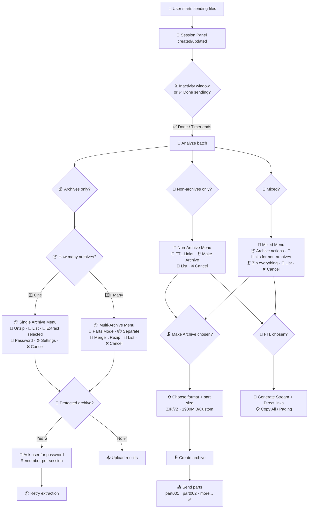

# 🤖 AIO File Utility Bot — Zip 🗜 / Unzip 📦 / Merge 🧩 / FTL 🔗 (Buttons-First)

An **all-in-one Telegram bot** that automatically detects what users are sending (archives vs normal files) and shows a **single interactive panel** (buttons-only, minimal spam) to perform actions:

- 🗜 Zip (with auto split for Telegram limits)
- 📦 Unzip (single / multi-part / split archives)
- 🧩 Merge (extract → combine → re-zip)
- 🔗 FTL (File-To-Link: stream + direct download links)

> Goal: “unzip-bot level” smoothness ✨ with a modern **Session Panel** UX.

---

## ✨ Key UX Idea — **Session Panel**
Instead of sending many messages, the bot:
- creates **one panel message**
- **edits** it as files arrive
- waits for **inactivity window** (e.g. 2–3s) OR user taps **✅ Done sending**
- then shows the correct **buttons menu** based on detected content

✅ Cleaner chats  
✅ Faster decisions  
✅ No confusion when users send multiple files

---

## 🧠 Smart Detection (Auto + Override)
The bot auto-classifies the batch into:

- 📦 **Archives Only**
- 📄 **Non-Archives Only**
- 🧩 **Mixed** (archives + normal files)

For multiple archives it also detects likely patterns:
- 🧩 **Parts Mode** (split archive parts: `.001`, `.part1.rar`, `.z01`, etc.)
- 📦 **Separate Archives** (independent zips/rars)
- Low confidence? User can override with buttons.

---

## 🧰 Features
### 🗜 Zip
- ✅ Collect unlimited files into an archive
- ✅ Auto-split output into multiple parts (Telegram-safe)
- ✅ Choose output type: **ZIP / 7Z** (optional)
- ✅ Choose part size: **1900MiB / 1024MiB / custom**
- ✅ Rename output (`/zipname`) or via buttons
- ✅ Automatic cleanup after completion

### 📦 Unzip
- ✅ Unzip a single archive
- ✅ Unzip **multi-part / split archives** (Parts Mode)
- ✅ Unzip **multiple archives** (Separate Mode)
- ✅ List contents before extracting 🧾
- ✅ Extract selected files 🎯

### 🔐 Password Support (Important)
- ✅ Set password for extraction: **🔐 Add Password**
- ✅ Remove password: **🔓 Remove Password**
- ✅ For protected archives: bot requests password input and retries extraction
- ✅ “Remember password” only **per session** (safer)

### 🧩 Merge / Re-Zip
- ✅ If user sends multiple archives:
  - extract all → combine → re-zip into one output
- ✅ Choose final output format + part size
- ✅ Useful when user receives random zips and wants one bundle

### 🔗 FTL (File-To-Link)
- ✅ Generate **direct download** + **stream** links for sent files
- ✅ Supports paging for many files (avoids FloodWait spam)
- ✅ “Copy all links” button 📋

### 🧼 Reliability
- ✅ One active job per user (prevents collisions)
- ✅ Cancel anytime ❌
- ✅ Disk space guard (optional but recommended)
- ✅ Session TTL auto-expire (e.g. 30–60 min inactivity)

---

## 📌 Commands (Minimal) — Buttons-First
> Most users can operate fully via buttons. Commands are mainly “entry points”.

### 🧾 General
- `/start` — show help + current session panel
- `/help` — quick usage
- `/commands` — list all commands
- `/cancel` — cancel current job/session

### 🗜 Zip
- `/add` — start collecting files for zipping
- `/zip <name>` — create archive now (optional if using buttons)
- `/zipname <name>` — set default archive name for session
- `/zipclear` — clear collected files

### 📦 Unzip
- `/unzip` — show unzip options for the current batch (optional)

### 🔗 FTL
- `/ftl` — show link generation options (optional)

### 🖼 Media/Extras (Optional)
- `/addthumb` — set thumbnail (reply to a photo)
- `/delthumb` — remove thumbnail
- `/mode` — upload mode (Document / Video, etc.)
- `/stats` — usage/admin stats (optional)

---

## 🧭 Workflows (Buttons-Only)
### 1) 📦 User sends **1 archive**
Bot shows:
- 📂 **Unzip**
- 🧾 **List contents**
- 🎯 **Extract selected**
- 🔐 **Add/Remove Password**
- ⚙️ **Settings**
- ❌ **Cancel**

### 2) 📦 User sends **multiple archives**
Bot asks:
- 🧩 **Parts Mode Unzip** (treat as one split archive)
- 📦 **Separate Unzip** (each archive separately)
- 🧩 **Merge → Re-Zip**
- 🧾 **List**
- ❌ **Cancel**

### 3) 📄 User sends **non-archive files**
Bot asks:
- 🔗 **Get Links (FTL)**
- 🗜 **Make Archive**
- 🧾 **Show list**
- ❌ **Cancel**

### 4) 🧩 User sends **mixed files**
Bot asks:
- 📦 **Archive actions**
- 🔗 **Links for non-archives**
- 🗜 **Zip everything**
- 🧾 **Show list**
- ❌ **Cancel**

---

## 🧾 Examples (Realistic Scenarios)

### ✅ Example A: Zip normal files into split parts
1. `/add`
2. send 10 files
3. tap ✅ Done sending
4. choose 🗜 Make Archive → select part size **1900MiB**
5. bot uploads: `backup.part001.zip`, `backup.part002.zip`, …

### ✅ Example B: Unzip a password-protected archive
1. send `protected.zip`
2. tap 📂 Unzip
3. bot asks: 🔐 “Send password”
4. user sends password
5. bot extracts and uploads results

### ✅ Example C: Multiple archives received — merge them into one zip
1. send `a.zip`, `b.zip`, `c.zip`
2. choose 🧩 Merge → Re-Zip
3. choose output: ZIP + 1900MiB parts
4. bot extracts all → combines → sends merged archive parts

### ✅ Example D: FTL links for videos
1. send 5 videos
2. choose 🔗 Get Links (FTL)
3. choose 🎬 Stream links / ⬇️ Direct links / 📋 Copy All

---

## 🗺️ Mermaid — Full Flow Diagram (with emojis)
> GitHub renders Mermaid automatically in Markdown.

