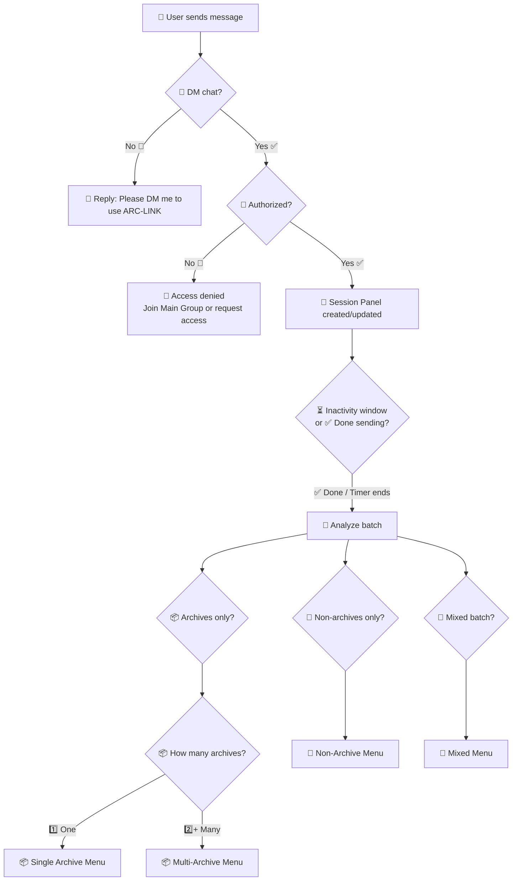

# 🤖 ARC-LINK: AIO File Utility Bot — Zip 🗜️ / Unzip 📦 / Merge 🧩 / FTL 🔗 (Buttons-First)

An **all-in-one Telegram bot** that auto-detects what users send (archives vs normal files) and responds using a **single Session Panel** (buttons-first, minimal chat spam).

✅ 🗜️ Zip (auto-split for Telegram limits)  
✅ 📦 Unzip (single / multi-part / multiple archives)  
✅ 🧩 Merge (extract → combine → re-zip)  
✅ 🔐 Password support (extract protected archives + add/remove password on output)  
✅ 🔗 FTL (File-To-Link: direct download + stream links)  
✅ 🔐 Authorization + DM-only access control  
✅ 📊 Stats (queue count, usage, disk space)  
✅ 🛠️ Admin Panel (live stats + auth/logs management)  
✅ 🧾 Logs Channel (file/job lifecycle logs)

---

## 🔐 Authorization & Access Control (DM-only)

This bot is designed to work **only in private chat (DM)**.

### ✅ Who can use the bot?
A user is allowed if **either**:
- 👥 They are a member of the **Main Group** (`MAIN_GROUP_ID` in `.env`)  
  *(the bot checks membership via `getChatMember` — the bot must be in that group)*  
**OR**
- ✅ They are added to the bot’s **Authorization List** (managed by admins)

### 🚫 Who is blocked?
- Any chat that is **not DM** (groups/channels): bot replies with a short “DM me” notice
- Any user who is **not in Main Group** and **not in Authorization List**

### 🛠️ Who manages access?
Admins (from `ADMIN_IDS`) can manage everything via **🛠️ Admin Panel**:
- Add/Remove users from Authorization List
- Change Main Group ID (runtime)
- Configure Logs Channel (runtime)

---

## ✨ Key UX: Session Panel (One Message, Always Updated)

Instead of spamming messages, the bot:

- creates **one panel message**
- **edits** it as files arrive
- finalizes when either:
  - user taps **✅ Done sending**, OR
  - an **inactivity window** (e.g. 2–3s) expires
- then shows the correct buttons based on what was detected

<details>
<summary><b>🧾 Session Panel Detailed Examples (click to expand)</b></summary>

### 🧾 Session Panel — Textual UI Examples (Emojis)

> Below are **mock panels** showing how the bot’s **single edited Session Panel** message can look in each scenario.  
> Buttons are represented as `[🔘 Button]`.

---

### 🟦 0) Collecting phase (live updates while user is sending)

**🧾 Session Panel**
```text
📥 Receiving files…
📦 Archives: 0   📄 Files: 3
📊 Total size: 842 MB
⏳ Waiting for more… (auto-finish in 2s)
```

Buttons:  
[✅ Done sending] [🧾 List] [❌ Cancel]

---

### 📦 1) Single archive detected (1 file)

**🧾 Session Panel**
```text
📦 Archive detected: pack.zip
📊 Size: 1.6 GB   |   🔒 Password: Unknown

What do you want to do?
```

Buttons:  
[📂 Unzip] [🧾 List contents] [🎯 Extract selected]  
[🔐 Password] [⚙️ Settings] [❌ Cancel]

---

### 🔒 2) Protected archive → bot asks for password

**🧾 Session Panel**
```text
🔒 Protected archive detected: protected.zip
❗ Password required to extract.

Send the password now (as a message), or cancel.
```

Buttons:  
[🔐 Enter password] [❌ Cancel]

✅ After user sends password:

**🧾 Session Panel**
```text
🔐 Password received (session only)
📦 Extracting… 37%
```

Buttons:  
[❌ Cancel]

---

### 🔓 3) After extracting protected archive → remove/add password & send

**🧾 Session Panel**
```text
✅ Extracted successfully: protected.zip
🔐 Password used: Yes (session)

What next?
```

Buttons:  
[✅ Send extracted files]  
[🔓 Remove password & send] [🔐 Add password & send]  
[❌ Cancel]

---

### 📦📦 4) Multiple archives detected → choose handling mode

**🧾 Session Panel**
```text
📦 4 archives detected
📊 Total size: 5.8 GB

🧠 Detected pattern: 🧩 Parts of one archive (High confidence)
Choose how to proceed:
```

Buttons:  
[🧩 Parts Mode Unzip] [📦 Separate Unzip]  
[🧩 Merge → Rezip] [🧾 List] [❌ Cancel]

---

### 🧩 5) Parts Mode chosen → missing part check

✅ All parts present:

**🧾 Session Panel**
```text
🧩 Parts Mode selected
🔎 Checking parts…

✅ Found: 12/12 parts
Proceed to extract?
```

Buttons:  
[📂 Unzip now] [🧾 List contents] [❌ Cancel]

⚠️ Missing parts detected:

**🧾 Session Panel**
```text
🧩 Parts Mode selected
🔎 Checking parts…

⚠️ Missing parts detected
Found: 10/12 parts

Continue anyway (may fail) or cancel?
```

Buttons:  
[⚠️ Force unzip] [❌ Cancel]

---

### 📄 6) Non-archives detected → choose FTL or Zip

**🧾 Session Panel**
```text
📄 7 files detected (non-archive)
📊 Total size: 1.2 GB

Choose a mode:
```

Buttons:  
[🔗 Get Links (FTL)] [🗜 Make Archive]  
[🧾 List] [❌ Cancel]

---

### 🔗 7) FTL chosen → pick link type + paging

**🧾 Session Panel**
```text
🔗 FTL mode selected
📄 Files: 7

Choose link type:
```

Buttons:  
[🎬 Stream links] [⬇️ Direct links] [📋 Copy all] [❌ Cancel]

After generating (paged):

**🧾 Session Panel**
```text
✅ Links ready (Page 1/2)
1) file1.mp4   🎬 Stream | ⬇️ Direct
2) file2.mp4   🎬 Stream | ⬇️ Direct
3) file3.mp4   🎬 Stream | ⬇️ Direct
```

Buttons:  
[⏭ Next page] [📋 Copy all] [❌ Cancel]

---

### 🗜 8) Zip chosen → choose format, part size, password

**🧾 Session Panel**
```text
🗜 Zip mode selected
📄 Files: 12
📊 Total size: 6.4 GB

Choose archive format:
```

Buttons:  
[🗜 ZIP] [🧊 7Z] [⬅️ Back] [❌ Cancel]

Next:

**🧾 Session Panel**
```text
📦 Choose part size (Telegram-safe):
```

Buttons:  
[1900MiB ✅ Recommended] [1024MiB] [Custom ✍️] [⬅️ Back] [❌ Cancel]

Optional password:

**🧾 Session Panel**
```text
🔐 Add password to output archive?
(If you skip, archive will be unprotected.)
```

Buttons:  
[🔐 Add password] [🔓 Skip] [⬅️ Back] [❌ Cancel]

After starting:

**🧾 Session Panel**
```text
🗜 Creating archive… 41%
📦 Output will be split into parts if needed.
```

Buttons:  
[❌ Cancel]

</details>

---

## 🧠 Smart Detection (Auto + Override)

The bot classifies the current batch into:

- 📦 **Archives only**
- 📄 **Non-archives only**
- 🧩 **Mixed** (archives + non-archives)

If multiple archives exist, it also tries to detect:

- 🧩 **Parts Mode** (split archive parts like `.001`, `.part1.rar`, `.z01`, etc.)
- 📦 **Separate Archives** (independent archives)

If detection is unsure, user can override via buttons:
- **Treat as Parts**
- **Treat as Separate**
- **Mixed options**

---

## 🧰 Features

### 🗜️ Zip
- ✅ Collect many files into one archive
- ✅ Auto-split output into multiple parts (Telegram-safe)
- ✅ Choose output: **ZIP / 7Z** (optional)
- ✅ Choose part size: **1900MiB / 1024MiB / Custom**
- ✅ Rename output via buttons or `/zipname`
- ✅ Optional: 🔐 **Add password** to output archive
- ✅ Cleanup after completion

### 📦 Unzip
- ✅ Unzip a single archive
- ✅ Unzip multi-part / split archives (**Parts Mode**)
- ✅ Unzip many independent archives (**Separate Mode**)
- ✅ List contents before extract 🧾
- ✅ Extract selected files 🎯

### 🔐 Password Support (Extraction + Output)
- ✅ **Protected archive detection**
- ✅ If protected, bot prompts: 🔐 “Send password”
- ✅ Password remembered **per session only**
- ✅ After extraction, user can optionally:
  - 🔓 **Remove password & send** (rezip unencrypted)
  - 🔐 **Add password & send** (rezip encrypted)

### 🧩 Merge / Re-Zip
For multiple archives in a batch:
- ✅ extract all → combine → re-zip into one archive
- ✅ choose output format + part size
- ✅ optional password on final output

### 🔗 FTL (File-To-Link)
- ✅ Generate **direct download** + **stream** links for sent files
- ✅ Paging for many files (avoids FloodWait spam)
- ✅ 📋 Copy all links

### 🔐 Authorization System
- ✅ DM-only usage (no group usage)
- ✅ Allow access if user is in **Main Group** OR in **Authorization List**
- ✅ Admin-managed Authorization List (add/remove)
- ✅ Admin can change Main Group ID at runtime

### 📊 Stats
- ✅ Shows **queue count** (how many jobs waiting/running — not full job details)
- ✅ Shows usage totals (jobs processed, unique users, uptime)
- ✅ Shows free disk space (+ optional memory/CPU)
- ✅ Admin version includes “who is currently using the bot”

### 🛠️ Admin Panel
- ✅ Live stats: connected users, active sessions, queue counts
- ✅ Manage Authorization List (add/remove users)
- ✅ Change Main Group ID (runtime)
- ✅ Configure Logs Channel (runtime)
- ✅ Enable/Disable logs + choose what to log

### 🧾 Logs System (Logs Channel)
- ✅ Sends file/job lifecycle logs to a logs channel
- ✅ Configurable via `.env` and changeable via Admin Panel
- ✅ Useful for moderation, debugging, and auditing usage

---

## 📌 Commands (Minimal — Buttons First)

Most users can operate fully via buttons. Commands are mainly entry points.

### 🧾 General (Users)
- `/start` — show help + current session panel
- `/help` — quick usage
- `/commands` — list all commands
- `/cancel` — cancel current job/session
- `/stats` — show bot stats (**queue count, usage, free disk**)  

### 🗜️ Zip
- `/add` — start collecting files for zipping
- `/zip <name>` — create archive now (optional if using buttons)
- `/zipname <name>` — set default archive name for session
- `/zipclear` — clear collected files

### 📦 Unzip / 🔗 FTL (Optional entry points)
- `/unzip` — show unzip actions for current batch (optional)
- `/ftl` — show link generation actions (optional)

### 🛠️ Admin (Admins only)
- `/admin` — open **Admin Panel**
- `/logs` — quick toggle or logs preview (optional; can also live inside Admin Panel)

### 🖼️ Extras (Optional)
- `/addthumb` — set thumbnail (reply to a photo)
- `/delthumb` — remove thumbnail
- `/mode` — upload mode (Document / Video etc.)

---

## 📊 Stats Output (Example)

**User `/stats`**
```text
📊 ARC-LINK Stats
🧾 Queue: 3 (waiting: 2, running: 1)
👥 Unique users: 148
✅ Jobs processed: 1,920
⏱ Uptime: 2d 04h

💾 Disk free: 37.4 GB
```

**Admin `/admin` → Stats**
```text
📊 Admin Stats
🧾 Queue: 3 (waiting: 2, running: 1)
🟢 Active sessions: 2
👥 Connected users: 148

👤 Currently using bot:
- @user1 (unzipping)
- @user2 (zipping)
```

---

## 🛠️ Admin Panel (Buttons UI Example)

```text
🛠️ Admin Panel — ARC-LINK

📊 Queue: 3 (2 waiting / 1 running)
🟢 Active sessions: 2
👥 Connected users: 148
💾 Disk free: 37.4 GB
🧾 Logs: ✅ Enabled  |  Channel: -1001234567890
👥 Main Group: -1009876543210
```

Buttons:  
[📊 Stats] [👥 Authorization] [👥 Main Group]  
[🧾 Logs] [📣 Set Logs Channel] [⚙️ Settings]  
[❌ Close]

### 👥 Authorization submenu
```text
👥 Authorization

✅ Allowed via Main Group: -1009876543210
✅ Additional allowed users: 23

Send a user ID / @username to add/remove.
```

Buttons:  
[➕ Add user] [➖ Remove user] [🧾 View list] [⬅️ Back]

### 🧾 Logs submenu
```text
🧾 Logs

Status: ✅ Enabled
Channel: -1001234567890

Choose what to log:
```

Buttons:  
[✅ File added] [✅ Job started] [✅ Job finished] [⚠️ Errors]  
[📣 Set channel] [🛑 Disable logs] [⬅️ Back]

---

## 🧾 Logs Channel (What gets logged)

When enabled, the bot sends logs like:

```text
🧾 LOG • Job Completed ✅
👤 User: @username (123456789)
🧩 Mode: Merge → Rezip
📦 Inputs: 3 archives (5.8 GB)
🗜 Output: merged.part001.zip … merged.part003.zip
⏱ Time: 03m 42s
🗓 2025-12-17 13:02:11
```

Suggested events to log:
- 📥 File added (name/size/type)
- ▶️ Job started (mode/settings)
- ✅ Job completed (outputs/parts)
- ❌ Job failed (error summary)
- 🔗 Links generated (count)

---

## 🧭 Workflows (Buttons-Only)

> Note: All workflows require **DM** + **Authorization**.

### 1) 📦 User sends **1 archive**
Bot shows:
- 📂 Unzip
- 🧾 List contents
- 🎯 Extract selected
- 🔐 Password (add/remove / prompt)
- ⚙️ Settings
- ❌ Cancel

### 2) 📦 User sends **multiple archives**
Bot asks:
- 🧩 Parts Mode Unzip (treat as one split archive)
- 📦 Separate Unzip (each archive independently)
- 🧩 Merge → Rezip
- 🧾 List
- ❌ Cancel

### 3) 📄 User sends **non-archive files**
Bot asks:
- 🔗 Get Links (FTL)
- 🗜️ Make Archive
- 🧾 Show list
- ❌ Cancel

### 4) 🧩 User sends **mixed files**
Bot asks:
- 📦 Archive actions
- 🔗 Links for non-archives
- 🗜️ Zip everything together
- 🧾 Show list
- ❌ Cancel

---

## 🗺️ Mermaid — Authorization Gate + Core Flow



---

## ⚙️ Configuration (.env)

```dotenv
# Telegram
BOT_TOKEN=123:ABC
API_ID=123456
API_HASH=abcdef1234567890

# Access control
MAIN_GROUP_ID=-1009876543210
ADMIN_IDS=123456789,987654321

# Logs
LOGS_CHANNEL_ID=-1001234567890
LOGS_ENABLED=true

# Storage (example)
DB_PATH=./data/bot.db
DOWNLOAD_DIR=./downloads
```

> Admin Panel can change **Main Group ID** and **Logs Channel ID** at runtime (persist in DB).

---

## ✅ Developer Notes (Implementation Targets)

- Primary UX = **one Session Panel message** edited throughout a session
- Authorization gate runs **before** creating/using Session Panel
- Membership check uses `getChatMember(MAIN_GROUP_ID, user_id)` (bot must be in group)
- Store Authorization List + runtime config in SQLite/JSON (persist across restarts)
- `/stats` shows **queue counts**, not verbose per-job status
- Admin Panel shows “who is using bot” + lets admins manage auth/logs
- Logs are optional but strongly recommended for debugging + auditing
